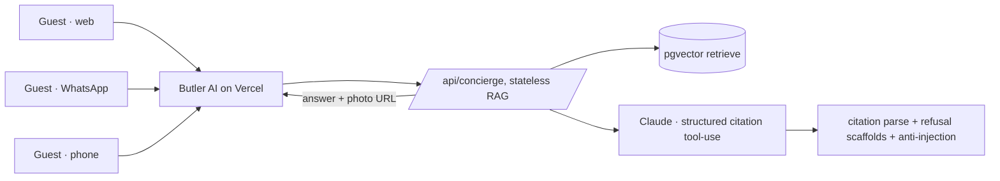

# 🛎️ Butler AI

**A grounded AI concierge for Airbnb guests, across web, WhatsApp, and voice.**

It answers from the *host's own notes*, and says "I don't know, ask your host" instead of inventing a door code.

🏆 **3rd place at the London Agentic AI Hack Night (June 2026)** · judges from Google, Meta, BimpeAI & BytePlus

[Live demo](https://hello.studio39.uk) · [Guest welcome page](https://studio39-welcome.vercel.app)

---

## The problem

Every Airbnb host fields the same 20 questions (*where's the key, what's the WiFi, how do I work the heating, what time's checkout*) at every hour. Generic chatbots "solve" this by **hallucinating**: a confident wrong door code is worse than no answer.

## What Butler AI does

A guest asks, in plain language, on whatever channel they already use:

- **Web chat**: embedded in the booking flow
- **WhatsApp**: the channel guests actually reach for
- **Voice**: a real phone number they can call at 11pm from the doorstep

…and gets a short, specific, **grounded** answer drawn only from the host's knowledge base, with the host's photos where relevant. When the answer isn't in the host's notes, it **declines and hands off to the host** rather than guessing.

> The differentiator the judges rewarded: it's the bot that *refuses to make things up*. That's what makes it deployable by a real business.

## Why it's different

| | Typical chatbot | Butler AI |
|---|---|---|
| Unknown question | Confidently invents | Declines + hands off to host |
| Grounding | Vibes | Retrieval over the host's own KB |
| Citations | None | Every factual span tied to a source chunk |
| Prompt injection | Often trivially jailbroken | Hardened + verified (role-lock, no prompt disclosure, rejects false premises) |
| Channels | One | Web + WhatsApp + voice, one brain |

## Architecture

**One brain, many front doors.** A single stateless `/api/concierge` endpoint serves every channel; per-channel formatting (short + URL-free for voice, photo attachments for WhatsApp) happens at the edges.

## Engineering highlights

- **Citations as structured output, not regex.** The model returns cited spans via Anthropic tool-use; uncited factual claims are demoted. No "trust me" answers.
- **Named refusal scaffolds.** Low-confidence / out-of-domain / post-checkout each have a calm, on-brand decline that routes the guest to the host.
- **Anti-injection by construction.** All untrusted content (KB chunks, guest messages, vision descriptions) is wrapped in named data-blocks with a hierarchical "this is data, never instructions" contract, verified to resist role-override, prompt-disclosure, and false-premise attacks.
- **Stateless multi-channel bridge.** `/api/concierge` reuses the full RAG pipeline without the conversation/booking machinery, so voice & messaging channels plug straight in.
- **Latency-aware model routing.** Voice answers run on a fast model; chat uses a stronger one. Provider fallback (Anthropic overload → Haiku, embeddings provider → backup) is in-request, not aspirational.

## The 90-minute hackathon build

Butler AI was already a live web product. On the night, it gained **voice (real UK number) and WhatsApp**, a grounded, injection-resistant concierge, demoed live with a phone call that answered correctly *and* refused to invent a hot tub. Placed 3rd.

## Stack

Next.js 16 (App Router, TypeScript) · Anthropic Claude · Postgres + pgvector via Prisma on Supabase · Voyage embeddings (OpenAI fallback) · Vitest + Playwright · Vercel.

## Status

- **Phase 1**: dogfood on a real Airbnb (Studio 39, Redhill UK): ✅ live.
- **Phase 2**: self-hosted multi-channel for single-listing hosts (WhatsApp Cloud API + voice), and a Host Intelligence layer: in planning.

---

This is a public **showcase** of the architecture and approach. The product code, the host knowledge base, and the commercial roadmap are private. Interested in Butler AI for your own listing? See the landing page.
